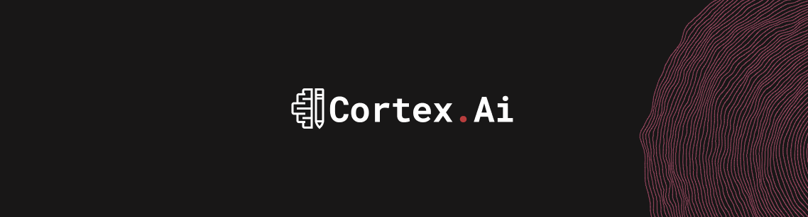

# Cortex.Ai

O projeto foi feito para praticar os conteúdos da cadeira de desenvolvimento web e foi usado para compor a nota da primeira unidade. 

## ✔️ Tecnologias utilizadas

- html, css e Js
- Bootstrap
- Api Venta.js
- Api 2 (em breve)

## 🔨 Prototipo de baixa fidelidade

https://www.figma.com/board/LTFEG8HB1WsGtfa6BrwsVS/Untitled?node-id=0-1&p=f&t=kXOWNziiefp2BNj5-0 

## 📃 prototipo de alta fidelidade

https://www.figma.com/design/iya0yFgXowAqCGXGtTsWac/Project-B?node-id=0-1&p=f&t=aKNGoWrvQ9qIAfAd-0

## 🛠️ Abrir e rodar os projetos

## 📚 Referências bibliográficas 

